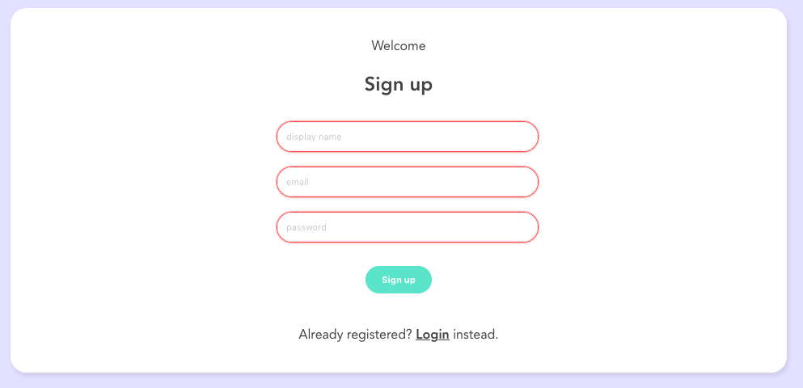

# Vue Live Chatroom
This project is based on the second project developed by [The Net Ninja (Shaun Pelling)](https://www.youtube.com/channel/UCW5YeuERMmlnqo4oq8vwUpg) on his excelent [Udemy course](https://www.udemy.com/course/build-web-apps-with-vuejs-firebase).

## Project Overview

### Login Screen


To use the app, one must authenticate. The authentication is based on email and password. There is no client-side validation for email and/or password values. There are submitted to Firebase straightaway as informed by the user.

### Signup Screen



If the user has no account, they can create one by signing up. The signup screen is accessed via a link, available on the bottom of the login screen. There is no e-mail and/or password validation on the client side. However, as Firebase is used, it may validate according to their rules.

### Chatroom


Once the user logs in, they are redirected to the chatroom. At the top of the screen, one can see the user's display name and e-mail. At the top left-hand corner, there is the logout button. 

At the center, one can find the messages exchanged by users. The app considers one single chatroom. In practice, it means that all messages are visible to all users.

Finally, at the bottom, there is an input for the message. The message is submitted when the user hits the `<Enter>` key.

## Views, Components & Composables Overview


The project consists of two main _views_: `Welcome` and `Chatroom` (`.vue`). The `App.vue` only uses the `router-view` to load the views. The `Welcome` _view_ consists of two components: `SignupForm` and `LoginForm`, which respectively represents the signup and login screen. The signup and login logic is in the `useSignup` and `useLogin` composables, respectively.

The `Chatroom` _view_ consists of three components. The `Navbar` component represents the top of the chatroom screen. It uses the `getUser` composable to identify the user currently logged in. It also uses the `useLogout` composable to log the current user out. The `Chatwindow` component represents the central part of the chatroom screen. It uses the `getCollection` composable to retrieve messages in real time. Finally, the `NewChatForm` _view_ represents the bottom of the chatroom screen. It uses the `getUser` composable to identify the message author. It also uses the `useCollection` composable to send the message to Firestore.

## Views, Components & Composables Details

This project extensively uses two of Vue 3 new features: the composition API and composables.

### Views
- `Welcome` is the main _view_. It uses a boolean property to switch between login and signup screens. Whereas the login screen is controlled by the `LoginForm` component, the signup screen is controlled by the `SignupForm`. Both components fire an event when their tasks are successfully completed. On this event, the `Welcome` _view_ invokes the router to send the user to the `Chatroom` _view_.

- `Chatroom` is the place where users exchange messages. This _view_ constantly _watches_ the currently logged user. In case of logout, the router sends the user back to the `Welcome` _view_. The logout is managed by the `Navbar` component. In addition to the `Navbar`, this _view_ also groups the `ChatWindow` and the `NewChatForm`. The _view_ has no further logic and/or components.

### Components

- `LoginForm` is responsible for receiving the user login data, and passing them to the `useLogin` composable. It exposes an error object in case of login issues. It also fires a `login` event in case of success.

- `SignupForm` is responsible for receiving the user signup data, and passing them to the `useSignup` composable. Like the `LoginForm`, this component also exposes an error object and fires an event (`signup`) when there is a signup error and a successfull signup, respectivelly.

- `Navbar` is responsible for showing the currently logged user name and enabling the user logout. Both functionalities are imported from the `getUser` and `useLogout` composables, respectively.

- `ChatWindow` is responsible for rendering exchanged messages. This component receives a message list from the `getCollection` composable. It uses the `date-fns` library to format the timestamp. The component also uses a simple strategy to auto-scroll the message list.

- `NewChatForm` is responsible for submitting the message of the the currently logged user. As previous components, this also uses composables. Whereas the `getUser` provides the user information, the `useCollection` saves the current message into Firebase.

### Composables

- `useLogin` calls Firebase auth API with email and password provided in the `LoginForm`.

- `useSignup` calls Firebase auth API with email and password provided in the `SignupForm`. If the signup succeeds, it also uses the API to saving the user name.

- `useLogout` calls Firebase auth API method responsible for loggin the user out. The request is sent by the `Navbar` component.

- `getCollection` calls the Firestore API to retrieve messages. The collection name is passed as argument to improve reusability. The message list object is ordered and a snapshot is created in order to use real time. 

- `useCollection` calls the Firestore API to save a message. Both the collection and the message object values are passed as argument for reusability reasons.

- `getUser` calls Firebase auth API to retrieving the currently logged user.

## Communication Flow

### The signup process


```
title Signup process

User->Welcome: Requests signup
Welcome->*SignupForm: Loads the signup form
SignupForm->*useSignup: Sends user data
useSignup->SignupForm: Returns object representing user data or error
SignupForm->Welcome: Emits signup event
Welcome->*router: Requests redirect to the chatroom
router->Chatroom: Redirects user 
```

### The login process


```
title Login process

User->Welcome: Opens the main page
Welcome->*LoginForm: Loads the login form
User->LoginForm: Inputs the user data
LoginForm->*useLogin: Sends user data
useLogin->LoginForm: Returns object representing user data or error
LoginForm->Welcome: Emits signup event
Welcome->*router: Requests redirect to the chatroom
router->Chatroom: Redirects user
```

### The messsage exchange process


```
title Message exchange process

User->Chatroom: Opens the main page
Chatroom->*Navbar: Loads the Navbar component
Navbar->*getUser: Requests currently logged user
getUser->Navbar: Returns and shows user data
Chatroom->*ChatWindow: Loads the ChatWindow component
ChatWindow->*getCollection: Retrieves message list
getCollection->ChatWindow: Returns and shows message list
Chatroom->*NewChatForm: Loads the NewChatForm component
User->NewChatForm: Writes new message and hit <Enter>
NewChatForm->getUser: Requests currently logged user
getUser->NewChatForm: Returns user data
NewChatForm->*useCollection: Submits message and user data
```

## File Structure


The Figure shows all files that were created/updated. Notice that some files were automatically created by the _Vue CLI_. 

## Dependencies

The project has two main dependencies. First, the project uses Firebase auth and datastore service for authenticating and saving/retrieving data, respectively. Second, the `data-fns` library is used to format the date showed on the messages.

## Data
Firestore database is used in this project.

## Running the Project Locally
Before running the project, ensure that you have NPM installed. You also need to set the Firebase app, auth and data storage configuration. Notice that the `firebase/config.js` needs the Firebase configuration in order to work. Check out the course if you need help ;)

1. Clone the project locally

```
git clone https://github.com/gabrielcostasilva/vue-live-chat-room.git
```

2. In the project folder, install dependencies

```
npm install
```

3. In the project folder, start the project.

```
npm run serve
```

4. Access the app with your browser at `http://localhost:8080`